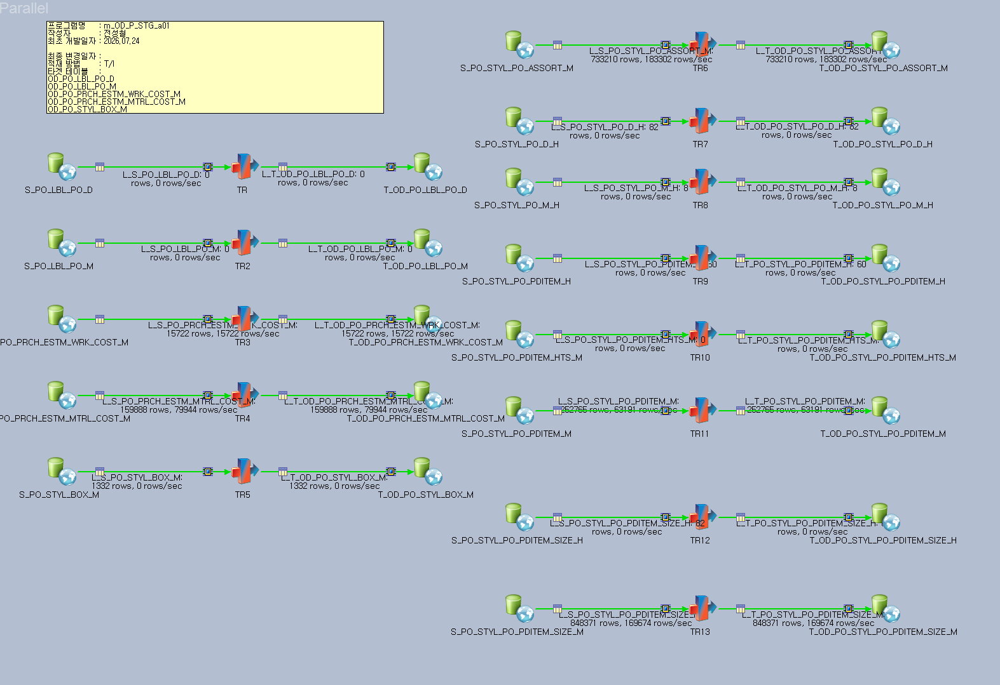

BIDW 구매발주(PO) 데이터 이관 작업
요약
[!summary]
ERP(MSSQL) 구매발주(PO) 관련 테이블 14건 중 13건을 BIDW(Vertica)
BIDWADM_CO
스키마에 신규 생성하고, DataStage ETL 잡 구성까지 완료. 총 353개 컬럼, 2,011,532건 적재.
1. 배경 및 요청 사항
ERP 구매발주(PO) 관련 테이블 14건 → BIDW(Vertica) 이관 요청
원본 스키마와 동일하게 생성해야 함 (원본 = ERP DB)
2. 사전 조사
2-1. Vertica 존재 여부 확인
sql
SELECT
table_schema, table_name

FROM
v_catalog.tables

WHERE
table_schema =
'BIDWADM_CO'
AND
table_name =
'...'
;
14건 중
1건(
OD_PO_PRCH_ESTM_M
)만 기존재
, 13건 신규 생성 필요
[!tip] 네이밍 규칙 발견
Vertica 쪽은 원본 테이블명 앞에
OD_
접두사
가 붙는 컨벤션. 이름이 완전히 일치하지 않으므로 최초엔
ILIKE
로 넓게 검색 후, 규칙 확인되면 정확 매칭으로 전환.
2-2. 원본 테이블명 불일치 발견
요청받은
PO_PRCH_ESTM_WRK_MTRL_COST_M
이 ERP에
존재하지 않음
LIKE '%PRCH_ESTM%MTRL%'
검색으로 실제 이름 특정 →
PO_PRCH_ESTM_MTRL_COST_M
(WRK 없음)
2-3. 스키마 중복 이슈
PO_STYL_PO_PDITEM_M
,
PO_STYL_PO_PDITEM_SIZE_M
두 테이블이
dbo
/
SETUP
스키마에 각각 존재, 컬럼 타입 미세 차이 있음
→
dbo
스키마를 운영 기준으로 확정
하여 진행
[!warning] 체크포인트
동일 테이블명이 여러 스키마에 있을 수 있다는 걸 항상 염두에 둘 것. 확인 없이 진행하면 잘못된 정의로 테이블 생성될 위험.
3. Vertica DDL 생성
컬럼 스펙 추출
sql
SELECT
c.TABLE_SCHEMA, c.TABLE_NAME, c.ORDINAL_POSITION, c.COLUMN_NAME,
c.DATA_TYPE, c.CHARACTER_MAXIMUM_LENGTH,
c.NUMERIC_PRECISION, c.NUMERIC_SCALE, c.IS_NULLABLE

FROM
INFORMATION_SCHEMA.COLUMNS c

WHERE
c.TABLE_SCHEMA =
'dbo'
AND
c.TABLE_NAME
IN
(...)

ORDER BY
c.TABLE_NAME, c.ORDINAL_POSITION;
타입 매핑 규칙
MSSQL
Vertica
비고
char(n) / varchar(n) / nvarchar(n)
CHAR(n×3) / VARCHAR(n×3)
길이 3배 확장
numeric(p,s)
NUMERIC(p×3, s)
precision만 3배, scale 유지
int
INTEGER
datetime / smalldatetime
TIMESTAMP
datetimeoffset
TIMESTAMPTZ
date
DATE
13개 테이블 CREATE TABLE DDL 작성 후 Vertica 실행 완료
4. DataStage ETL 잡 구성
잡명:
m_OD_P_STG_a01
구조: Source(MSSQL Connector) → Transformer → Target(Vertica Connector)
13개 테이블 각각 개별 잡으로 구성 (13개 스테이지 세트)
처리 방식:
Full Load
(Truncate 후 재적재)
[!note] 작업 소요 관련
DataStage 구조상 테이블·컬럼을 수기로 로드 후 매핑해야 해서 13건 개별 작업에 시간이 다소 소요됨

5. 결과 검증
Vertica 실제 컬럼 수 재조회 → ERP 원본과 1:1 대조
sql
SELECT
table_schema, table_name,
COUNT
(*)
AS
column_cnt

FROM
v_catalog.columns

WHERE
table_schema =
'BIDWADM_CO'
AND
table_name
IN
(...)

GROUP BY
table_schema, table_name;
→
전체 일치 확인
(오차 없음)
최종 결과표
테이블명
컬럼 수
적재 건수
PO_LBL_PO_D
26
0
PO_LBL_PO_M
28
0
PO_PRCH_ESTM_WRK_COST_M
19
15,722
PO_PRCH_ESTM_MTRL_COST_M
20
159,888
PO_STYL_BOX_M
15
1,332
PO_STYL_PO_ASSORT_M
17
733,210
PO_STYL_PO_D_H
27
82
PO_STYL_PO_M_H
61
8
PO_STYL_PO_PDITEM_H
40
60
PO_STYL_PO_PDITEM_HTS_M
20
0
PO_STYL_PO_PDITEM_M
39
252,768
PO_STYL_PO_PDITEM_SIZE_H
21
82
PO_STYL_PO_PDITEM_SIZE_M
20
848,380
총 컬럼 353개 / 총 적재 2,011,532건
[!info] 적재 0건 테이블 (3건)

PO_LBL_PO_D
,
PO_LBL_PO_M
,
PO_STYL_PO_PDITEM_HTS_M
— ERP 원본 데이터 자체가 없는 상태로 확인됨 (정상, 잡 실패 아님).
6. 권한 부여
sql
GRANT
USAGE
ON
SCHEMA
BIDWADM_CO
TO
P_STG;

GRANT
SELECT
,
INSERT
,
DELETE
,
TRUNCATE
ON
BIDWADM_CO.OD_PO_LBL_PO_D
TO
P_STG;

-- (13개 테이블 동일 패턴 반복)
신규 생성 13개 테이블 전체에
P_STG
권한 부여 완료
7. 완료 보고
위 내역 종합하여 요청자에게 완료 보고 메일 발송 (DataStage 잡 스크린샷 첨부)
다음에 참고할 점
Vertica 존재 확인 시 이름 불일치 가능성 항상 염두 (
OD_
접두사 같은 네이밍 컨벤션 먼저 파악)
요청받은 테이블명 ≠ 실제 원본명일 수 있음 →
LIKE
검색으로 먼저 크로스체크
동일 테이블명이
dbo
/
SETUP
등 여러 스키마에 있을 수 있음 → 운영 스키마 명확히 확정 후 진행
DataStage RCP(Runtime Column Propagation) 활용 시 범용 잡 1개 + Parameter Set + Sequence Loop로 반복 작업 시간 단축 가능 (다음엔 이 구조 우선 고려)
