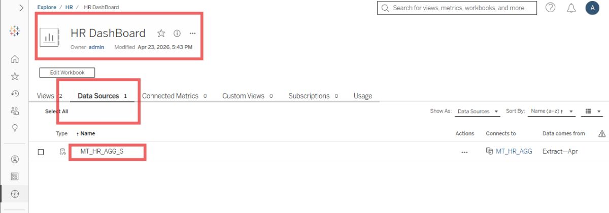
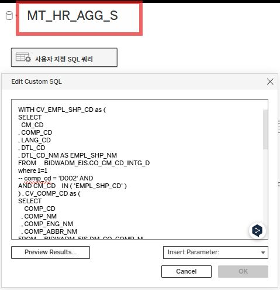
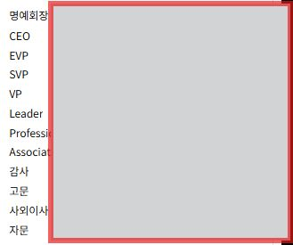

# Tableau 대시보드 변경 작업

- [장애 현상]
- 테블로 대시보드 화면에서 회사에서 예전에 쓰던 직급인
- "대리" , "과장" 등의 직급이 보여지는 현상이 있었음
- [원인]
- 테블로 대시보드를 만드는 소스 데이터 자체에서
- 현재는 미사용중인 예전 직급명까지 불러오는 것이 근본적인 원인이었음
- [해결 및 조치]
- 대시보드 소스 통 테이블을 만드는 쿼리를 수정하였음.

- Edit Datasource를 통해 현재 대시보드를 만들기 위해 사용중인 SQL 통 쿼리를 확인.

- FULL 쿼리에서, USE_YN = 'Y' 조건을 걸어두어서 소스 데이터 자체를 사용중인 직급만 가져오도록 설정함.
- [결과 및 예방책]

- 사용중인 직급만 보여지도록 조치가 완료되었음

---

*DE | Tableau 대시보드 변경 작업 | 2026-04-23*
