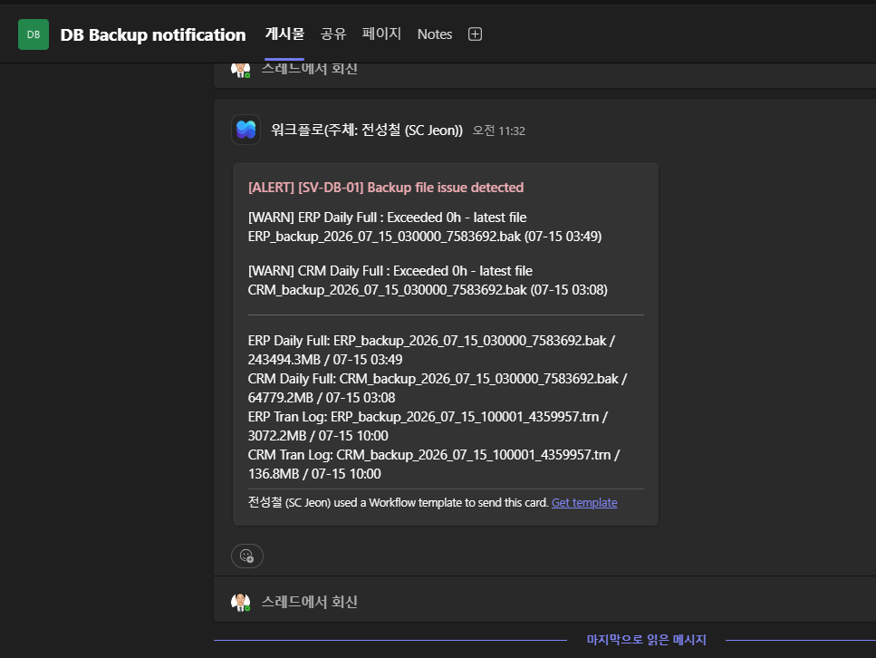

2026-07
작업 기록
:
DB
백업 상태 체크 자동화

배경
기존에는 담당자가 매일 출근 후
DB
서버에
직접 접속하여
ERP/CRM Daily
백업의 성공
/
실패 여부를 수동으로 확인해왔음
.
확인
누락 가능성과 장애 인지 지연
(
최대 익일 오전까지 미인지
)
리스크가
존재
.
목적
백업 성공
/
실패
여부를
Teams
웹훅을 통해 자동으로 수신
하는 무인 감시 체계 구축
.
구현 내용
1.
감시 스크립트 작성
파일
:
C:\Scripts\Check-BackupFiles.ps1
백업
Job/Agent
의 성공 로그가 아닌
,
실제 백업 파일의 존재 여부
·
최신성
·
크기
를 직접 검증하는 방식으로 구현
감시 대상
:
ERP Daily Full (
D:\ERPDB\BACKUP\DAILY
)
CRM Daily Full (
D:\ERPDB\BACKUP\DAILY
)
ERP Tran Log (
D:\ERPDB\BACKUP\TRAN
)
CRM Tran Log (
D:\ERPDB\BACKUP\TRAN
)
임계값은 각 백업의 실제 주기
·
평균 크기를 실측하여 설정
2.
알림 채널

— Teams
웹훅
Teams Workflows
기반
Incoming Webhook
생성
(
내부
인원만 접근 가능한 사내 채널 대상
)
PowerShell
에서
Adaptive Card
형식으로
payload
구성 후 웹훅
URL
로

POST
발송
성공
/
실패 여부 모두 매 실행 시 통지
되도록 구성
(
정상 시
[OK]

카드
,
이상 시
[ALERT]
카드
)
발송 실패 시에도
Windows
이벤트 로그
(Application,
소스
:
DBA_BackupCheck
)
에 증적 기록
→
알림 채널
장애 시에도 로컬 확인 가능
3.
방화벽
(FortiGate)

아웃바운드 개방
DB
서버
→ Teams
웹훅
(Power Platform
엔드포인트
)
방향

아웃바운드 전용
정책 신규 추가
목적지는
Wildcard FQDN(
*.
api.powerplatform.com
)
으로 등록
—
엔드포인트
IP
가 유동적
(Azure
백엔드
)
이라
IP
기반 대신
FQDN
기반으로 구성
포트
: TCP 443
만 허용
,
최소
개방 원칙 적용
4.
작업 스케줄링
Windows
작업 스케줄러에 등록
(
DBA_BackupFile_Check
)
실행 계정
: SYSTEM
실행 주기
:
매일 오전
7
시
1
회
트러블슈팅 이력
(
참고
)
스크립트 내 한글 사용 시 인코딩
(UTF-8/CP949)
문제로 콘솔
·Teams
카드 텍스트 깨짐 발생
→
전체 메시지를 영문으로 전환하여 해결
Teams
발송 시 간헐적 타임아웃 발생
→
Invoke-RestMethod
를
Invoke-WebRequest
로 교체
, TLS 1.2
명시적
지정으로 해결
웹훅
URL
파싱 오류
(
잘못된 URI
에러
)
발생
→
함수 스코프
문제 가능성을 배제하기 위해 웹훅
URL
을 함수 파라미터로 명시적 전달하도록 리팩토링
결과
백업 파일 정상
/
이상 여부를
매일 오전
7
시
, Teams
채널로
자동 수신
담당자의 수동 접속
·
확인 절차 제거
알림 발송 실패 시에도 이벤트 로그 증적이 남아 감시 공백 없음

